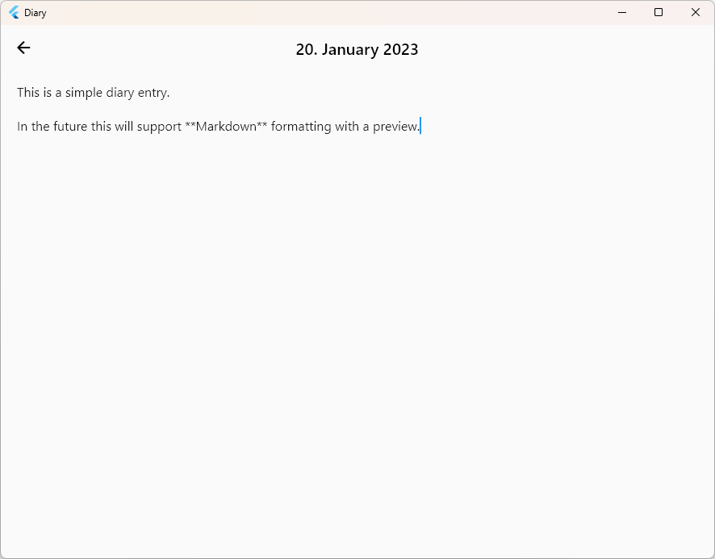

# Diary

> A digital diary with state-of-the-art encryption.




## Background

I feel like the days of traditional diaries are over.
Not only are they inconvenient to carry around, but they are also not very secure.
Thus, I decided to create a digital diary that is secure and easy to use.

## Technology

The project is a local Desktop application that stores all data locally in a Git repository.
If you want to save your date in the cloud you can add a remote repository (should be private).
All files in the repository are encrypted using the ChaCha20-Poly1305 cipher which uses a 256-Bit key.
That is plenty to protect your diary for the next years.
The key is derived from a password using the **Argon2** algorithm, which is currently the recommended algorithm.
You can only decrypt the diary again using the same password.
In the future we might add support for a second factor like a FIDO2 key that offers a higher level of security.

## Installation

### Build it yourself

```bash
cd client
flutter build windows
```

You'll find the executable in `client/build/windows/runner/Release/`.

## Usage

The app currently consists of a simple calendar that just shows whether a day has an entry or not.
When clicking on the day in the calendar you'll be able to either create a new entry or edit an existing one (if you
know the password for decryption at least).

The encrypted diary entries are stored under your home directory in a folder named `.diary`.

## Getting started

### Prerequisites

- Install Rust
- Install Flutter
- Install LLVM (https://pub.dev/packages/ffigen#installing-llvm)

### Rebuilding Flutter <> Rust bridge

Run `./tools/build_bridge.sh` or `./tools/build_bridge.bat` depending on your OS
